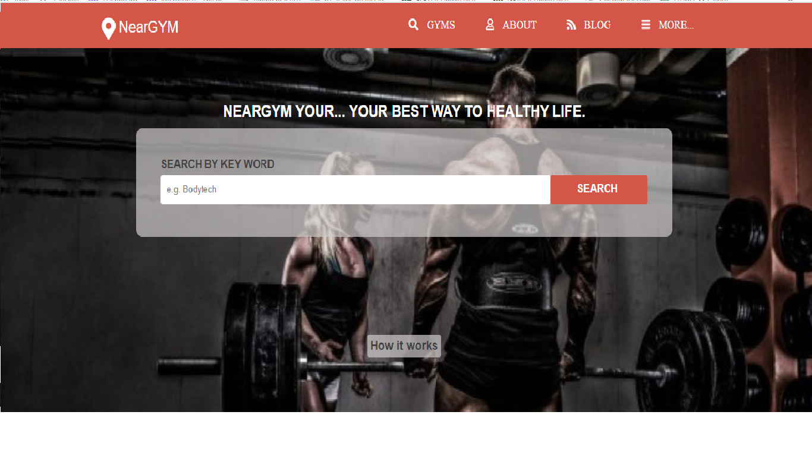
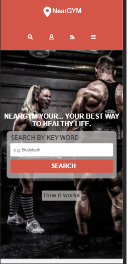
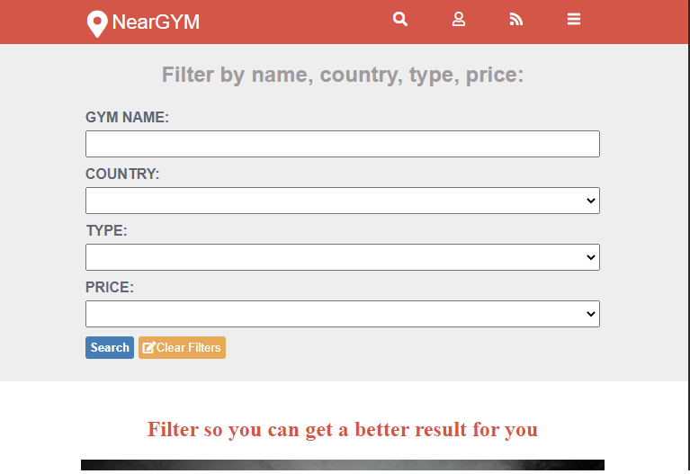
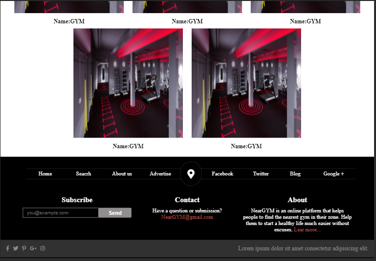

# Capstone project

This project is a directory page that helps people to find a great GYM wherever they want. It uses the same design from the project Patashule.  [link of the original project](https://www.behance.net/gallery/25563385/PatashuleKE).
The page has a main page, a filters page, and information about the gym selected. 

## Built With :

 - HTML 
 - sCSS
 - GitHub

## Demo Link:
[live demo](https://rawcdn.githack.com/BrianSammit/capstone/305099b1366f0feb6d97d2a277987dcbfbe95c8a/index.html)

## Authors  

👤 Brian Sammit Cruz Rodriguez

Github: [@BrianSammit]( https://github.com/BrianSammit)

Twitter: [@CruzSammit](https://twitter.com/CruzSammit)

Linkedin: [Brian Sammit](https://www.linkedin.com/in/brian-sammit-cruz-rodriguez-5877551a8/)

## 🤝 Contributing
Contributions, issues and feature requests are welcome!
Feel free to check the issues page.

## Show your support ⭐️
Give a ⭐️ if you like this project!  

## Acknowledgments
Hat tip to anyone whose code was used Inspiration etc 

## 📝 License 

This project is MIT licensed.
